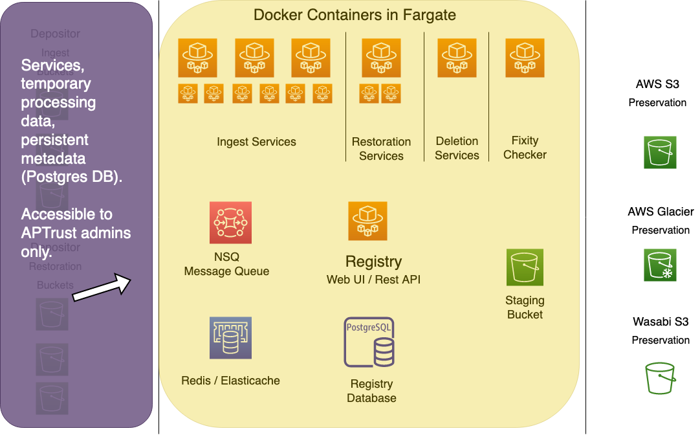

# System Overview

Preservation services consists of the following components:

* A set of Docker containers, each running a microservice to handle various aspects of the ingest, restoration, deletion and fixity processes.
* NSQ - a queue service for orchestrating work items.
* Redis/Elasticache - for sharing interim processing data between workers.
* S3, Glacier and Wasabi for storage
* The Registry REST API for storing and retrieving persistent metadata about the content of our preservation repository.

While other parts of this documentation describe the components in detail, this page provides a graphical overview of the system's components, where they live, and how they communicate.

# The High Level

The components of the system are divided into three privilege zones, with privileges enforced by IAM roles and policies.

Depositors have access to the leftmost zone in the diagram below. They can upload files into their own receiving buckets for ingest, and download them from their own restoration buckets for retrieval. Depositors can access only their own buckets, no one else's.

The rightmost zone is preservation storage. No one can access this except the IAM account of the Go workers, which has full access, and APTrust admins, who have read-only access.

The Go service workers move items from depositor receiving buckets on the left into long-term preservation storage buckets on the right. They also move items from long-term storage back to depositor restoration buckets. The workers keep temporary housekeeping data about items in process in Redis/Elasticache, and store permanent data in the Registry. All of the working components of the system--all services using CPU and memory--live in the middle zone.

Depositors cannot access anything in the middle zone. APTrust administrators can, generally through the AWS console and CloudFormation templates.

The diagram below shows all of the components in their respective zones. Details follow below.

!!! Note

    These diagrams omit two containers that run cron jobs. The bucket
    reader, also called `apt_queue`, scans depositor receiving buckets
    for new ingests. It creates an ingest WorkItem for each new bag and
    queues it in the NSQ `ingest01_prefetch` topic.

    The `apt_queue_fixity` worker runs every half hour or so, queueing
    files for fixity checks. Files stored in S3 and Wasabi are checked
    every 90 days.

# Ingest

During the ingest process, depositors upload bags (tar files) to their receiving buckets. A cron scans for new bags, creating a WorkItem in the Registry for each one, and then putting that WorkItem's ID into NSQ for the Ingest workers to pick up.

Ingest workers perform a number of functions, including bag validation, format identification, and more. Then they move files into preservation storage and record the results of their work in the Registry.

!!! Note
    In the diagrams below, all ingest workers read to and write from
    both Redis and NSQ. Arrows are omitted to minimize clutter.

## NSQ

NSQ keeps track of which tasks need to go to which workers. For Ingest, a cron job running in the `apt_queue` container creates and queues new WorkItems for each new bag that shows up in a receiving bucket.

For deletion and restoration, users make requests through the Registry Web UI, and Registry pushes the WorkItem IDs into NSQ's deletion and restoration topics.

For fixity checks, a cron job running in `apt_queue_fixity` queries Registry for files in S3 or Wasabi storage that have not had a fixity check in 90 days. It pushes the IDs of those files into NSQ, usually in batches of 2,500-3,000 every half hour.

## Redis/Elasticache

Redis stores info about what work has already been done on any task in the ingest process. New workers can pick up partially completed tasks and pick up work where the last worker left off. The housekeeping data in Redis ensures two things:

1. that no work is skipped or left incomplete
2. that completed work is not unnecessarily repeated

## The Pre-Fetch Worker

The pre-fetch worker streams a bag from a depositor's receiving bucket through a series of functions to do the following:

1. Gather a list of files in the bag.
2. Calculated fixity values on those files.
3. Extract tag files, manifests, and tag manifests to an S3 staging bucket for later processing.

## The Validation Worker

The validation worker ensures a bag is valid according to its BagIt profile. APTrust currently supports APTrust and BTR (Beyond the Repository) BagIt formats.

A bag is valid if it contains all of the payload files mentioned in the manifests, and if the checksums of those files match the checksums in the manifests. The bag must also contain a set of BagIt standard tags with valid values, plus whatever tags are required by the specified BagIt profile.

Note that profiles also specify which checksum algorithms and required and which others are permitted. The validator enforces those rules as well. If a bag is incomplete, if it contains extraneous payload files not mentioned in the manifests, or if it is missing required tags or required checksum algoriths, it will fail validation, the system will not ingest it, and processing stops here.

The validation worker tends to complete its work quickly, generally in a fraction of a second. It simply analyzes all of the metadata stored in Redis by the pre-fetch worker, which as already done the hard work of inventorying contents and calculating checksums.

## Reingest Check

The reingest checker asks Registry if this bag has ever been ingested before. Bags have unique identifiers composed of the identifier of the owning instituion, followed by a slash and the name of the bag, minus the .tar extension. For example, if the University of Virginia uploads a bag called `photos.tar`, the bag's Intellectual Object Identifier becomes `virginia.edu/photos`.

If the Registry has an active (non-deleted) record of an object whose identifier matches the one we're currently ingesting, it checks each file in the new bag against records in the registry. If the file exists in Registry, the worker compares the Registry checksum to the checksum calculated by the pre-fetch worker.

If the checksum has changed, or if the file does not exist in Registry, the worker flags the file as needing to be saved to preservation storage. If Registry already has a record of this file and the checksum has not changed, the file will be flagged as not needing to be copied to preservation.

The reingest checker prevents us from storing duplicate copies of existing files under new UUIDs. (Everything in preservation storage is stored with a UUID key, not its original file name.)

## Staging Uploader

The staging uploader unpacks bags from depositor ingest buckets and stores their individual files in an S3 staging bucket. Files in the staging bucket are stored with a key composed of WorkItem ID and file UUID. E.g. `34546/ddeff40b-f995-42f0-b002-389cf331193d`.

Subsequent workers that need to access these files can retrieve them from this staging bucket. S3 works well for write-once/read-multiple workloads. Because it's a network resource, not tied to local block storage, its contents are available to all of our ingest workers.

## Format Identifier

The format identifier streams files from the staging bucket through a set of algorithms that compare the file's bits to known signatures in the PRONOM registry. It updates each file record in Redis with the file's mime type.

## Preservation Uploader

The preservation upload copies files from the staging bucket to preservation storage.

## Preservation Verifier

The preservation verifier performs a HEAD request on every item copied into preservation storage to retrieve its metadata. Where possible, it compares each file's etag in preservation storage to its md5 checksum to ensure integrity. Etag comparison isn't possible on larger files, so it compares the file size in preservation with its know file size.

The verifier is basically a sanity check to provide basic assurance that files were successfully copied to preservation.

## Recorder

The recorder records metadata about the ingest in the Registry, including info about the Intellectual Object and all of its files. For each file, it records checksums, storage records and a set of ingest Premis events. It also records Premis events for the object.

## Cleanup

The cleanup worker deletes the original bag from the depositor's receiving bucket, then deletes all interim processing data from the S3 staging bucket and Redis. Finally, it marks the ingest as complete in the Registry and in NSQ.

# Restoration

APTrust users initiate object and file restoration through the Registry Web UI. They click a button to restore either an individual file, or an entire intellectual object (a bag).

Clicking the button causes Registry to create a restoration WorkItem, and to add the WorkItem ID to one of three NSQ topics:

* restore_object is the topic for object restoration.
* restore_file is for file restoration.
* restore_glacier is for Glacier restoration.

Glacier restoration requires an extra step of moving files from an inaccessible Glacier vault into an accessible S3 bucket so the files can be restored. Once the Glacier restorer gets the necessary files into an accessible S3 bucket, it pushes the restoration request into the normal `restore_object` or `restore_file` topics.

File restorations involve copying only a single file into a depositor's restoration bucket. Object restorations require gathering and re-bagging sets of files and moving the whole tarred bag into the restoration bucket.

While the file restorer ensures a file's checksums are correct before making a restoration copy, the object restorer reassembles and validates an entire bag full of files. It does this on the fly, streaming files into a bag in the restoration bucket without those files ever touching local disk. It calculates checksums as it goes, ensuring the bag is valid and complete. If the bag is not valid or is incomplete, the restoration WorkItem will be marked as failed in the Registry.

Note that because we rebuild bags when we restore them, the restored bag will not exactly match the original bag. The payload should be the same (unless the depositor deleted some files before the restoration), but the order of files within the tar archive may differ.

In addition, we store both the bag-info.txt and aptrust-info.txt files with the payload in preservation, and we give those back to the depositor upon restoration. Depositors have been storing essential metadata in bag-info and aptrust-info, and they want that info back when they do a restoration.

# Deletion

Deletions are also initiated in the Registry. Once a deletion request has been created and approved by an institutional admin, Registry creates a deletion WorkItem and queues it in NSQ's `delete_item` topic.

For file deletions, the deletion worker deletes all copies of the specified file from all known locations. That's typically either one S3 bucket, one Glacier vault, or one Wasabi bucket. Items in Standard storage are deleted from both S3 in Virginia and Glacier in Oregon.

For object deletions, the deletion worker deletes all copies of all files that belong to the specified object.

After deletion, the worker records deletion Premis events for all of the deleted files, changes the state of those files from `A` (active) to `D` (deleted) in the Registry, and marks the WorkItem as done. For object deletions, the worker changes the object state to `D` and records a deletion Premis event for the object.

# Fixity Checks

A containerized cron job called `apt_queue_fixity` runs every half hour or so, asking the Registry for a list of files stored in S3 or Wasabi that have not had a fixity check in the past 90 days. We do not check fixity on items in Glacier or Glacier Deep storage.

`apt_queue_fixity` pushes the Generic File IDs of files needing a fixity check into the `fixity_check` queue, usually in batches of 2,500 or 3,000.

The fixity checker calculates checksums on the bitstream coming from S3 or Wasabi. The files never touch local disk. It records the results of each fixity check in a Premis event.

The fixity checker is the only worker whose tasks are not recorded in WorkItems. It would be excessive to do so, since the system has performed over a hundred million checks, and all the data we need to capture from a check is captured in the Premis event.
